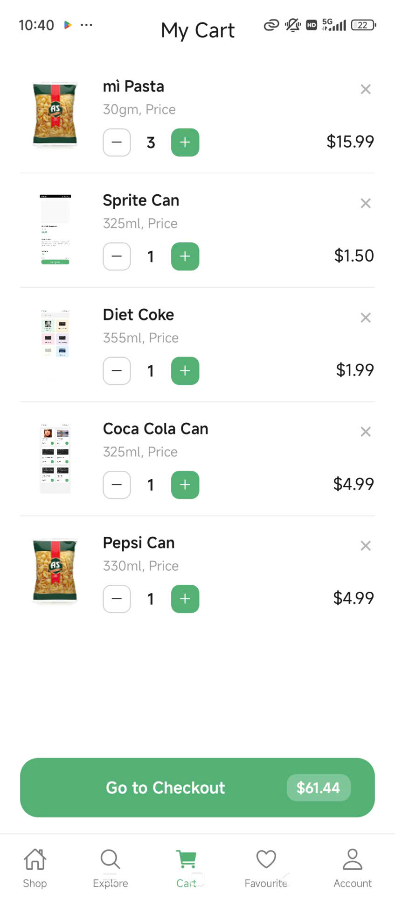
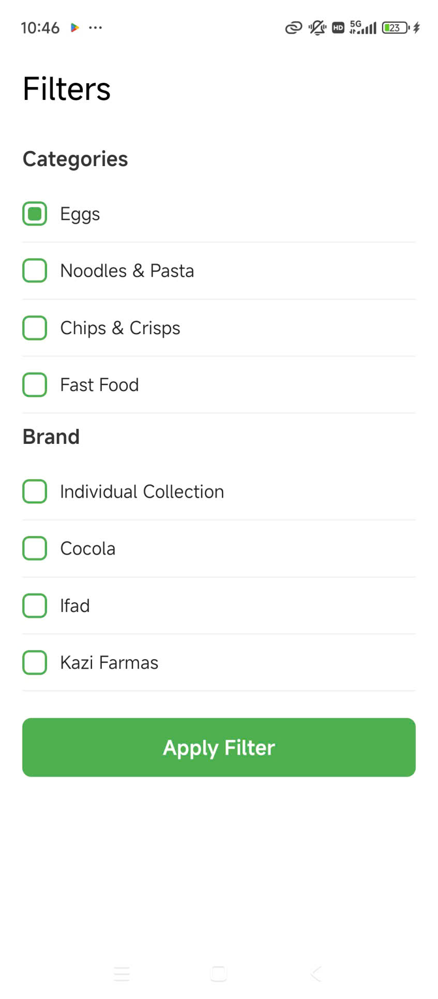
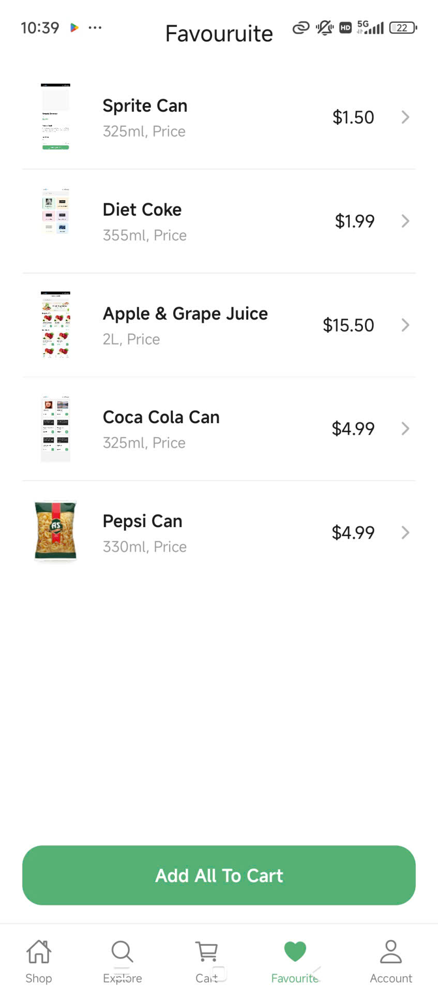
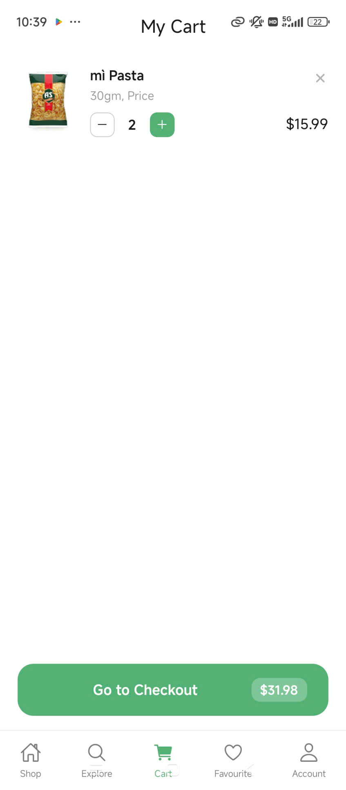
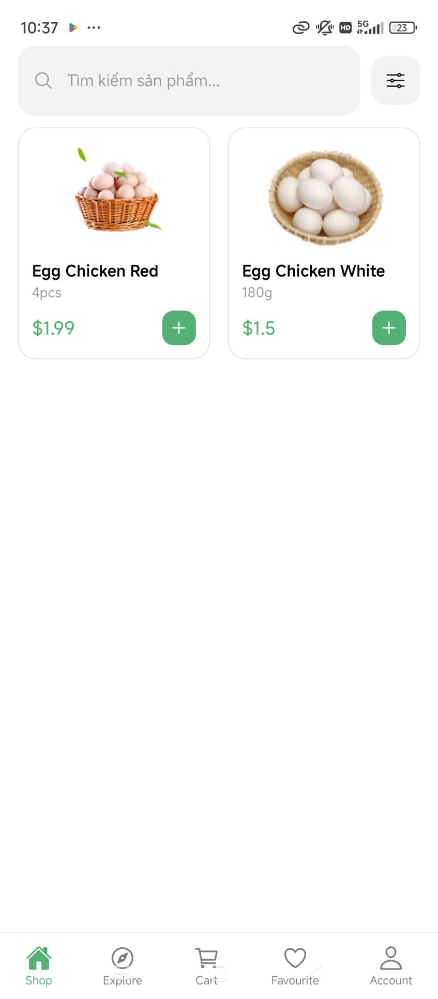
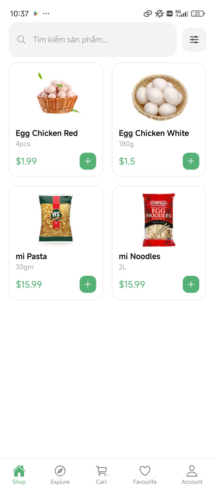

Họ và Tên: Trần Tiến Đạt 
lớp :D18CNPM5 MSV: 23810310322 
Mô tả :
Thực hành 06/04/2026 (N2): Nectar App - P4 - Search/Filter
 ( Dạ thầy ơi bài Bài tập 03.1: Custom component trc đó em đẩy lên rồi mà ấn nộp mạng yếu không lên đc em không chú ý nên ko đc nộp nếu tính điểm thầy bỏ qua cho em v ạ nếu đc em cám ơn ạ :>>> )

